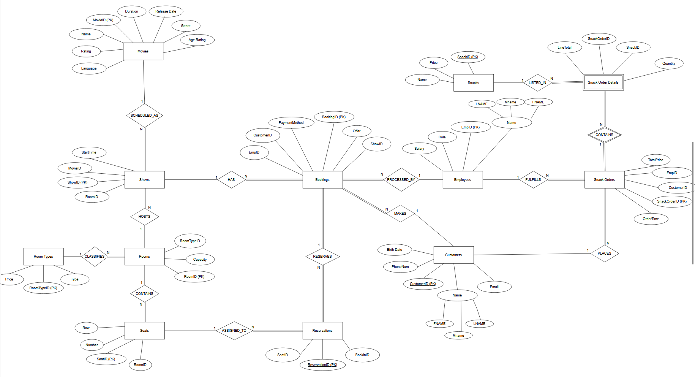

# 🎬 Cinema Database Management System

A comprehensive database system for managing cinema operations including movie scheduling, ticket booking, seat reservations, and snack orders.

## 📋 Project Overview

This project implements a relational database system to handle all aspects of cinema management:
- **Movie Scheduling**: Track movies, showtimes, and room assignments
- **Ticket Booking**: Customer reservations with seat selection
- **Snack Orders**: Food and beverage purchase tracking
- **Employee Management**: Staff roles and payroll
- **Revenue Tracking**: Booking and sales analytics

## 🗂️ Database Schema

### Entity-Relationship Diagram

The system consists of **12 interconnected tables**:

### Core Entities
- **Movies**: Movie information (name, genre, rating, duration, age rating)
- **Shows**: Screening schedules linking movies to rooms and times
- **Rooms**: Theater rooms with capacity and type (Standard/VIP)
- **RoomTypes**: Room classifications with pricing
- **Seats**: Individual seat inventory per room

### Customer & Booking
- **Customers**: Registered customer profiles
- **Bookings**: Ticket purchases with payment details
- **Reservations**: Seat assignments for bookings

### Snack Management
- **Snacks**: Menu items with pricing
- **Snack_Orders**: Customer snack purchases
- **Snack_Order_Details**: Line items for each order

### Staff
- **Employees**: Staff information with roles and salaries

## ✨ Key Features

### For Customers
✅ Browse available movies with showtimes and ratings  
✅ View real-time seat availability  
✅ Book tickets with seat selection  
✅ Order snacks and beverages  
✅ Receive booking confirmations with full details  

### For Administrators
✅ Manage movie schedules and room assignments  
✅ Track employee information and payroll  
✅ View most popular movies and snacks  
✅ Generate revenue reports  
✅ Monitor booking trends and payment methods  

## 🔐 Business Rules Implemented

- Age-restricted booking enforcement (customers must meet movie age rating)
- Unique seat reservations (no double-booking)
- Room scheduling validation (no overlapping shows)
- Customer data integrity (unique email and phone number)
- Seat availability tracking (automatic updates on booking/cancellation)
- Payment method options (Card or Cash)
- Employee role assignments

## 📊 Sample Queries

The system includes pre-built queries for common operations:

1. **Available Movies & Showtimes** - Display all current movies with schedules
2. **Seat Selection Status** - Show available/reserved seats for each show
3. **Booking Confirmations** - Generate customer booking details
4. **Payment Analytics** - Breakdown of payment methods used
5. **Ticket Sales Report** - Count tickets sold per movie
6. **Snack Orders** - Track customer snack purchases

## 🛠️ Technology Stack

- **Database**: SQL Server
- **Design**: Entity-Relationship modeling using drawio
- **Tools**: SQL, Database normalization (3NF)

## 📈 Future Enhancements

- [ ] Add loyalty program and customer rewards
- [ ] Implement online payment gateway integration
- [ ] Add movie ratings and reviews system
- [ ] Create promotional offers and discount management
- [ ] Implement automated email confirmations
- [ ] Add reporting dashboard for managers

